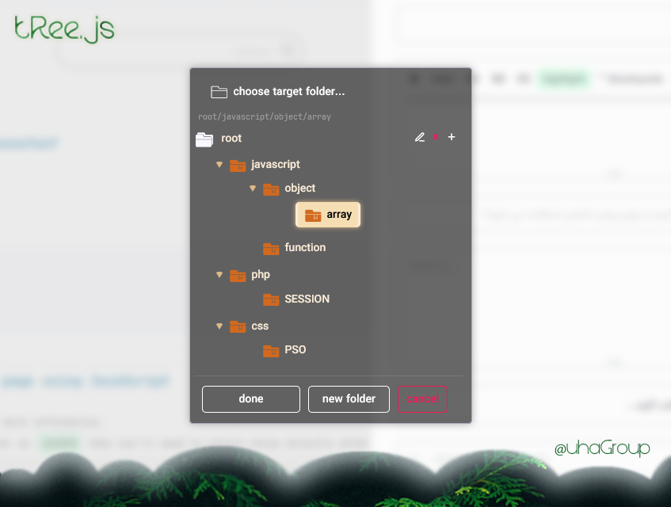

# tRee.js
Treeview library



## Usage
Note that almost all options are default.

## css
your default font and other affected the tRee elements.

like :
```css
    button {
      background-color: #E6E8F3;
    }
    
    * {
         font-family: tahoma; 
         font-weight: 500; 
         font-size: 12px;   
      }
    
```


## Installation Instructions
```html
  <script type="text/javascript" src="tRee-min.js"></script>
```


## Quick Start

```js
// empty tree
let tree_obj;
new tRee().show( (id,path,change) => {
 // id : string
 // path : string
 // change : bool
 
 // for update tree
 if(change) {
  tree_obj = treeView.tree();
 }
 
});
```


## on change listener
```js
treeView.onChange( tree => {
  tree_obj = tree;
})
```

## options

```js
// empty tree
let tree_obj;
let treeView = new tRee();
let options = treeView.options();
   
   log : 
       options = {
            id : 'tRee-container', // id of root element
            titleText : "choose target branch...", // title of dialog
            className : "tRee", // css class name
            doneText : 'done',
            newFolderText : "new branch",
            cancelText : "cancel",
            error1 : "first choose target branch!",
            error2 : "you can't create this branch!",
            error3 : "branch not exist!",
            error4 : 'id not found!',
            prompTitle : "enter title ...",
            prompRenameTitle : "new title ...",
            libNameHide : false, // if you want hide title (tRee.js) = true | show = false  
        }

  // change
  options.titleText = 'some thing else...';
  options.doneText : 'add';
  options.newFolderText : "new branch";
  treeView.options(options);
```


## Everything in tRee.js
```js
// show dialog (first build tree then show)
treeView.show( (id,path,change) => {} ); // @return tRee;

// get branch
treeView.getById(id:string); // @return object;

// check id
treeView.existId(id:string); // @return bool;

// new branch
treeView.newBranch(parentId:string,name:string); // @return tRee;

// delete branch
treeView.delete(id:string); // @return object;

// rename
treeView.rename(id:string,newTitle:string); // @return tRee;

// custom style
treeView.customStyle(className:string); // @return tRee;

// tRee object
treeView.tree(); // @return tRee object;

// hide/show "tRee.js" on top
treeView.libNameHide(bool:false); // @return tRee;

// build tRee dialog
treeView.build(); // @return tRee html element;

// container (most call after .build() or .show() )
treeView.container(); // @return tRee html element;

// show(unHide) tRee dialog
treeView.unHide(); // @return tRee;

// hide tRee dialog
treeView.hide(); // @return tRee;

// delete tRee html element (this function called after close dialog)
treeView.destroy(); // @return tRee;

// for custom style as css minified text
treeView.css = 'css minified text';
```


## tRee object
```js
    let default_tree = [{title: "root", id : '#root', children: []}];
    
    let some_tree = [{ title : "root", id : '#root',
            children : [
                {
                    title : "Branch 1",
                    id : 'someId' ,
                    children : []
                },
                {
                    title : "Branch 2",
                    id : 'someId2' ,
                    children : []
                },
                {
                    title : "Branch 3",
                    id : 'someId3' ,
                    children : [
                        {
                            title : "Branch 3 sub",
                            id : 'someId3 sub1' ,
                            children : []
                        },

                    ]
                },
            ]
        }];
        
    let treeView = new tRee(some_tree);
```


## HTML Element (tRee foundation)
```html
<!--tRee alpha background--> 
<div id="tReeAlphaBG">
    <a href="https://github.com/UhaGroup/tRee.js">tRee.js</a>
</div>

<!--tRee dialog--> 
<div id="tRee-container" class="tRee">
    <div class="tRee-caption">
        <p>choose target branch...</p>
    </div>
    <input readonly="" value="root/" type="text" id="tRee-input-addr">
    <div class="tReePop">
        <span id="spanEdit"></span>
        <span id="spanDelete"></span>
        <span id="spanSubBranch"></span>
    </div>
    <ul>
        <li>
            root
            <ul>
                <li>
                    <span class="marker marker-down"></span>
                    <a>sub</a>
                    <ul></ul>
                </li>
            </ul>
        </li>
    </ul>
    <div class="tRee-footer">
        <button id="tRee-done">done</button>
        <button id="tRee-newBranch">new branch</button>
        <button id="tRee-cancel">cancel</button>
    </div>
</div>
```

## Icons (tRee-font)

```css
/*most add font folder in root dir.*/

@font-face {
    font-family: 'tRee-Font';
    src: url("tReeFonts/tRee.eot?5kiojs");
    src: url("tReeFonts/tRee.eot?5kiojs#iefix") format("embedded-opentype"),
    url("tReeFonts/tRee.ttf?5kiojs") format("truetype"),
    url("tReeFonts/tRee.woff?5kiojs") format("woff"),
    url("tReeFonts/tRee.svg?5kiojs#icomoon") format("svg");
    font-weight: normal;
    font-style: normal;
}

/*title*/
div.tRee .tRee-caption > p::before {}

/*root icon*/
div.tRee > ul > li:nth-child(1)::before {}

/*branch icon*/
div.tRee ul li > a::before {}

/*del icon*/
div.tRee .tReePop span:nth-child(2)::before {}

/*rename icon*/
div.tRee .tReePop span:nth-child(1)::before {}

/*add sub branch icon*/
div.tRee .tReePop span:nth-child(3)::before {}

```
create custom font-icon use [icomoon](https://icomoon.io).
